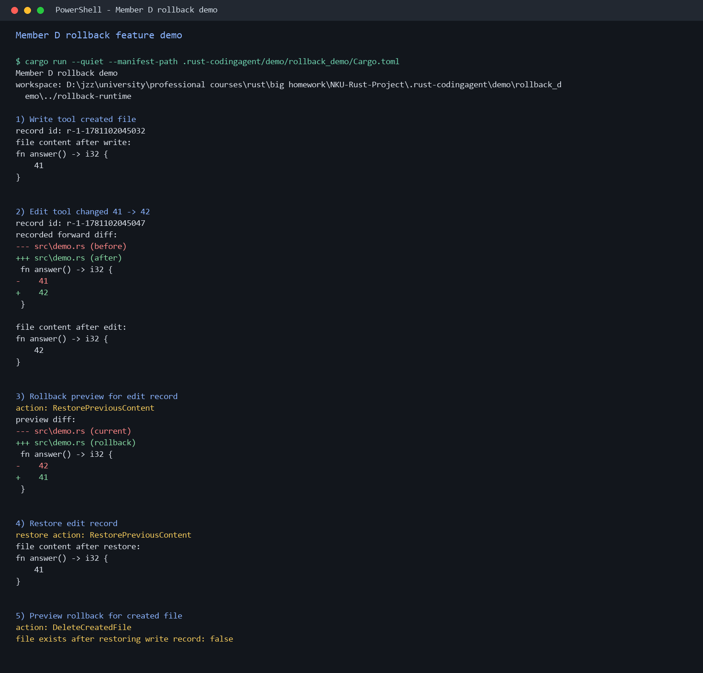

<div align="center">

# NKU Rust Coding Agent

用 Rust 实现的命令行 Coding Agent 底座：从会话持久化、文件工具调用到代码修改回滚，先把 Agent 在 CLI 场景中最关键的工程链路跑通。


</div>

## 📖 项目简介

`NKU Rust Coding Agent` 是一个面向课程展示和后续扩展的 Rust 版 Agent CLI 项目。它不追求一次性做完完整智能编程助手，而是先把 CLI Agent 的底层能力拆清楚：命令入口、配置加载、会话状态、工具协议、文件操作和代码回滚。

当前版本已经实现四个核心层：

- `cli`：命令行入口、配置合并、REPL 主循环。
- `core`：会话、消息、Provider 抽象和本地状态持久化。
- `tools`：文件读取、写入、编辑、搜索和 shell 执行。
- `rollback`：对 `Write` / `Edit` 工具调用自动记录快照、diff，并支持预览和恢复。

真实 LLM provider 和完整 Agent 工具调度还没有接入，但现有 crate 边界已经为后续扩展留出了清晰位置。

## 📸 项目一览

| 回滚演示 |
| --- |
|  |
| 通过 `Write` 新建文件，再通过 `Edit` 修改内容；回滚模块记录修改前后快照和 diff，随后恢复旧内容并删除本次新建文件。 |

## 🔁 核心流程

```text
用户输入
  |
  v
CLI / REPL 读取配置并接收命令
  |
  v
Core 创建或恢复 Session，维护消息历史和 AgentContext
  |
  v
Provider 后续生成回复或工具调用计划
  |
  v
Tools 执行读写、编辑、搜索、命令
  |
  v
Rollback 记录 Write/Edit 快照，支持预览和恢复
```

当前已经打通的是 `cli -> core`、`core -> tools` 的基础接口，以及 `rollback -> tools` 的包装式工具调用。后续只需要把真实 provider 和工具调度层接进来，就能形成完整 Agent 闭环。

## ✨ 核心亮点

| 能力 | 已实现内容 |
| --- | --- |
| 🧭 CLI 骨架 | 使用 `clap` 提供 `run`、`config`、`--help`、`--config <FILE>`，默认进入 REPL 主循环。 |
| 🗂️ 会话持久化 | 使用 `.rust-codingagent/` 保存 active session、消息历史、profile、workspace 和模型配置。 |
| 🧩 Provider 抽象 | 定义 `LanguageProvider`、`ProviderRequest`、`ProviderResponse`，不把项目绑定到某个具体模型服务。 |
| 🛠️ 工具协议 | 用 `ToolRequest` / `ToolOutput` 统一 Read、Write、Edit、Grep、Shell 的输入输出。 |
| 🔒 路径保护 | 工具层会 canonicalize workspace，拒绝默认读写工作区外文件。 |
| ↩️ 回滚创新 | `RollbackManager` 包装 `Write` / `Edit`，记录 before/after snapshot、diff、changed files，并支持 `preview`、`restore`、`restore_file`。 |

## 🧱 模块结构

```text
NKU-Rust-Project/
├── Cargo.toml
├── README.md
├── LICENSE
├── crates/
│   ├── cli/          # 命令行入口、配置加载、REPL
│   ├── core/         # Session、Message、Provider trait、AgentContext、SessionStore
│   ├── tools/        # Read / Write / Edit / Grep / Shell
│   └── rollback/     # 快照、diff、回滚预览和恢复
├── docs/
│   ├── 1-handoff.md
│   ├── 2-core-handoff.md
│   ├── 3-tools-handoff.md
│   ├── 4-rollback-handoff.md
│   └── assets/
└── tests/
    └── integration/
```

## 🛠️ 技术栈

| 分类 | 技术 |
| --- | --- |
| 语言与构建 | Rust 2021, Cargo workspace |
| CLI | `clap` |
| 配置与持久化 | `serde`, `toml` |
| 日志 | `tracing`, `tracing-subscriber` |
| 文件搜索 | `regex`, `ignore` |
| 路径处理 | `dunce` |
| 错误处理 | `anyhow` |

## 🚀 快速启动

### 1. 编译

```powershell
cargo build --workspace
```

### 2. 查看帮助

```powershell
cargo run -- --help
```

当前命令：

| 命令 | 作用 |
| --- | --- |
| `cargo run -- run` | 启动 Agent REPL |
| `cargo run -- config` | 打印最终生效配置 |
| `cargo run -- --help` | 查看 CLI 帮助 |

### 3. 启动 REPL

```powershell
cargo run -- run
```

可以输入：

```text
hello
/session
/history
/model better-model
exit
```

普通输入目前会生成占位回复：

```text
received: hello
```

这表示 REPL 和 session 持久化已经打通，不表示真实 LLM 已接入。

### 4. 查看配置

```powershell
cargo run -- config
```

配置优先级：

```text
默认值 < rust-codingagent.toml < --config 指定文件 < 环境变量
```

支持的环境变量：

| 变量名 | 作用 |
| --- | --- |
| `RUST_CODINGAGENT_PROFILE` | 当前 profile |
| `RUST_CODINGAGENT_WORKSPACE` | 工作区路径 |
| `RUST_CODINGAGENT_LOG_LEVEL` | 日志等级 |
| `RUST_CODINGAGENT_PROVIDER` | Provider 名称 |
| `RUST_CODINGAGENT_MODEL` | 模型名称 |
| `RUST_CODINGAGENT_API_BASE` | Provider API 地址 |

## 🧪 验证

提交前建议运行：

```powershell
cargo fmt --all -- --check
cargo test --all
cargo build --workspace
cargo clippy --workspace --all-targets --all-features -- -D warnings
```

当前测试覆盖：

| crate | 覆盖重点 |
| --- | --- |
| `cli` | 配置读取、REPL 启动、退出、历史持久化、模型切换、CLI 集成命令 |
| `core` | session 保存、恢复、列表排序 |
| `tools` | Read / Write / Edit / Grep / Shell、覆盖保护、路径越界拒绝 |
| `rollback` | Write/Edit 回滚记录、预览、恢复、单文件恢复、Read 不记录 |

## 📚 文档入口

| 文档 | 内容 |
| --- | --- |
| [docs/1-handoff.md](docs/1-handoff.md) | CLI 骨架交接说明 |
| [docs/2-core-handoff.md](docs/2-core-handoff.md) | core 会话层接口与对接说明 |
| [docs/3-tools-handoff.md](docs/3-tools-handoff.md) | tools 工具层接口与行为说明 |
| [docs/4-rollback-handoff.md](docs/4-rollback-handoff.md) | rollback 模块、快照、diff、恢复流程说明 |

## 👥 开发团队

| 成员 | 负责方向 | 当前交付 |
| --- | --- | --- |
| 成员 A | CLI 与工程骨架 | 启动入口、命令解析、配置加载、日志和最小主循环 |
| 成员 B | 核心状态与会话 | session、message、history、provider trait、AgentContext、SessionStore |
| 成员 C | 基础工具层 | Read、Write、Edit、Grep、Shell、workspace 路径保护 |
| 成员 D | 版本回滚创新 | 快照、diff、回滚预览、按步骤恢复、按文件恢复、本地持久化 |
| 成员 E | 测试与集成 | CLI/core/tools/rollback 测试与最终集成整理 |

## 📌 项目说明

- `.rust-codingagent/` 是本地运行状态目录，已加入 `.gitignore`，不会提交到仓库。
- 当前没有真实 LLM provider，`LanguageProvider` 只是抽象接口。
- rollback 核心库已经完成，但还没有做成用户可见的 `/rollback` REPL 命令。
- `ShellTool` 可能产生复杂副作用，当前 rollback 不自动记录 shell 修改。
- 回滚 diff 是轻量级文本 diff，适合 CLI 预览和课程展示，不等同于完整 git patch。

## 📄 License

本项目使用 MIT License，详见 [LICENSE](LICENSE)。

<div align="center">

Rust CLI Agent 的底座已经搭好，下一步就是把模型调度、工具调用和回滚交互真正串成完整链路。

</div>
